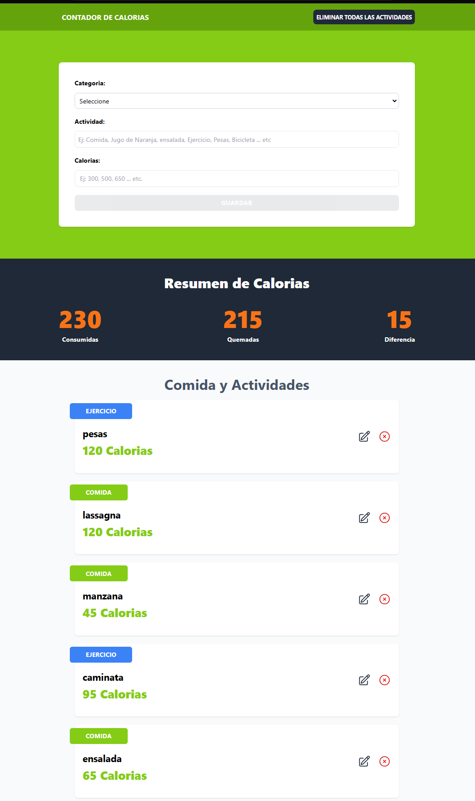

# Contador de Calorías - React y TypeScript

Este proyecto es una aplicación de contador de calorías desarrollada con React y TypeScript, utilizando Vite como herramienta de construcción. La aplicación permite a los usuarios registrar y gestionar actividades y comidas, junto con las calorías asociadas a cada una.

## Tecnologías Utilizadas

- **React**: Biblioteca de JavaScript para construir interfaces de usuario.
- **TypeScript**: Un superconjunto de JavaScript que añade tipos estáticos.
- **Vite**: Herramienta de construcción rápida para proyectos web modernos.
- **Tailwind CSS**: Framework de CSS para un diseño rápido y eficiente.
- **ESLint**: Herramienta de análisis de código estático para identificar y reportar patrones en el código.
- **uuid**: Biblioteca para generar identificadores únicos universales (UUID).

## Instalación y Configuración

1. Clona el repositorio:
   ```sh
   git clone https://github.com/tu-usuario/calorie-tracker.git
   cd calorie-tracker
   ```

2. Instala las dependencias:
   ```sh
   npm install
   ```

3. Inicia el servidor de desarrollo:
   ```sh
   npm run dev
   ```

4. Abre tu navegador y navega a http://localhost:3000.

## Scripts Disponibles
* npm run dev: Inicia el servidor de desarrollo.
* npm run build: Construye la aplicación para producción.
* npm run lint: Ejecuta ESLint para analizar el código.
* npm run preview: Previsualiza la aplicación construida.

## Configuración de ESLint
El proyecto utiliza ESLint para mantener la calidad del código. La configuración se encuentra en el archivo eslint.config.js y se puede expandir para habilitar reglas de linting basadas en tipos.

## Contribuciones
Las contribuciones son bienvenidas. Si deseas contribuir, por favor abre un issue o envía un pull request.


- **¡Gracias por visitar este proyecto! Si tienes alguna pregunta o sugerencia, no dudes en contactarme.**

Puedes visitar la aplicación en el siguiente enlace:

[](https://calories-trackers.netlify.app/)


